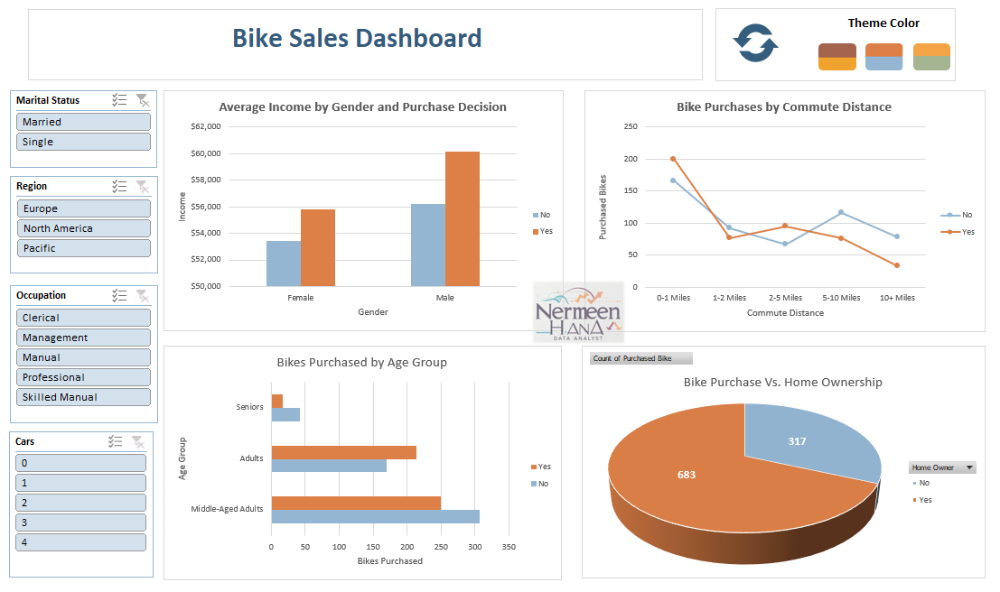

## 🚴‍♂️ Bike Sales Dashboard

### 📝 Overview
An interactive Excel dashboard analyzing bike purchase trends based on customer demographics, income levels, commuting distance, and home ownership.

### 🎯 Objectives
- Identify factors influencing bike purchases.
- Understand customer demographics (age, marital status, occupation, etc.).
- Explore the relationship between income, commute distance, and purchase decisions.

### 📂 Dataset
- **Source**: Fictional dataset (commonly used for Excel dashboard practice).
- **Size**: ~1,000 rows, multiple categorical and numerical fields.
- **Key Fields**: Gender, Age, Income, Commute Distance, Marital Status, Occupation, Cars Owned, Home Ownership, Purchase Decision.

### 🛠 Skills & Tools Used
- Pivot Tables & Pivot Charts  
- Slicers for interactive filtering  
- Conditional formatting  
- Custom chart formatting and color themes

### 📈 Key Insights
- Higher-income individuals are more likely to purchase bikes.
- Commute distance plays a significant role — most purchases occur for short commutes (0–1 miles).
- Middle-aged adults form the largest purchasing group.

### 🖼 Dashboard Preview

