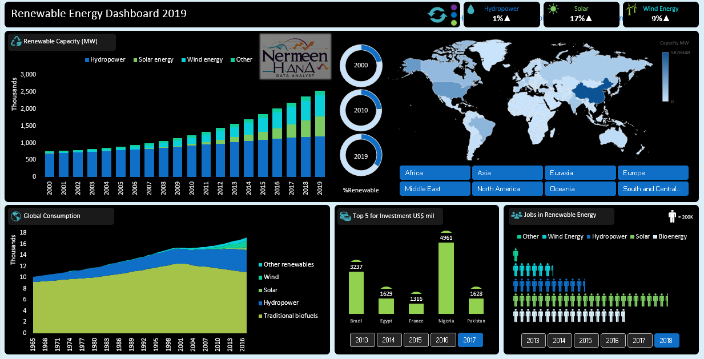

## 🌱 Renewable Energy Dashboard

### 📝 Overview
An interactive Excel dashboard visualizing global renewable energy trends between 2000 and 2019, highlighting capacity, investment, and jobs in the sector.

### 🎯 Objectives
- Track renewable energy capacity growth over time.
- Identify leading regions and countries in renewable energy adoption.
- Understand investment trends and job distribution by energy type.

### 📂 Dataset
- **Source**: Open renewable energy statistics (public datasets for visualization practice).
- **Size**: Multi-year dataset with data for all continents and major countries.
- **Key Fields**: Renewable capacity, global consumption, investments, jobs by energy type.

### 🛠 Skills & Tools Used
- Multiple dashboard sheets (Drilldown, Renewable Energy, Investment, Capacity by Region, etc.)
- Custom color themes and background design
- Combination of charts: line, stacked bar, pie, map visualizations
- Interactive slicers for region and year

### 📈 Key Insights
- Solar and wind energy show the fastest growth rates globally.
- Europe and Asia lead in renewable capacity.
- Investment is concentrated in specific countries (e.g., Brazil, Egypt, France, Nigeria, Pakistan).

### 🖼 Dashboard Preview

