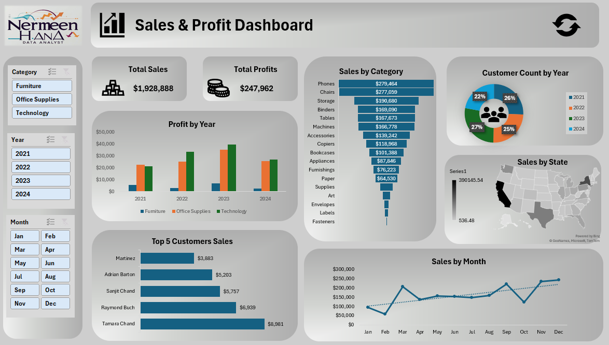

## 💼 Sales & Profit Dashboard

### 📝 Overview
An interactive Excel dashboard tracking total sales, profits, customer counts, and product category performance over multiple years.  
It provides insights into top-selling products, customer distribution, and sales trends by state and month.

### 🎯 Objectives
- Monitor overall sales and profit performance.
- Compare product category profitability across years.
- Identify top customers and highest-revenue product categories.
- Track sales distribution across U.S. states.
- Analyze seasonal and monthly sales patterns.

### 📂 Dataset
- **Source**: Fictional sales dataset for Excel dashboard practice.  
- **Size**: Multi-year transactional sales data.  
- **Key Fields**: Order Date, Category, Product, Sales, Profit, Customer Name, State, Year, Month.

### 🛠 Skills & Tools Used
- Pivot Tables & Pivot Charts for dynamic analysis  
- Slicers for filtering by category, year, and month  
- Funnel charts for category sales ranking  
- Geographic maps for state-level performance  
- Custom formatting for KPI cards (Total Sales & Total Profit)  
- Combination of chart types (bar, pie, line, and map)

### 📈 Key Insights
- **Phones** and **Chairs** are the top revenue-generating categories, each exceeding $270K in sales.  
- The most profitable year for **Technology** was 2023, with profits surpassing $40K.  
- **Tamara Chand** is the top customer, contributing nearly $9K in sales.  
- California is the highest revenue-generating state with over $390K in sales.  
- Sales show a steady upward trend over the year, with December peaking.

### 🖼 Dashboard Preview

